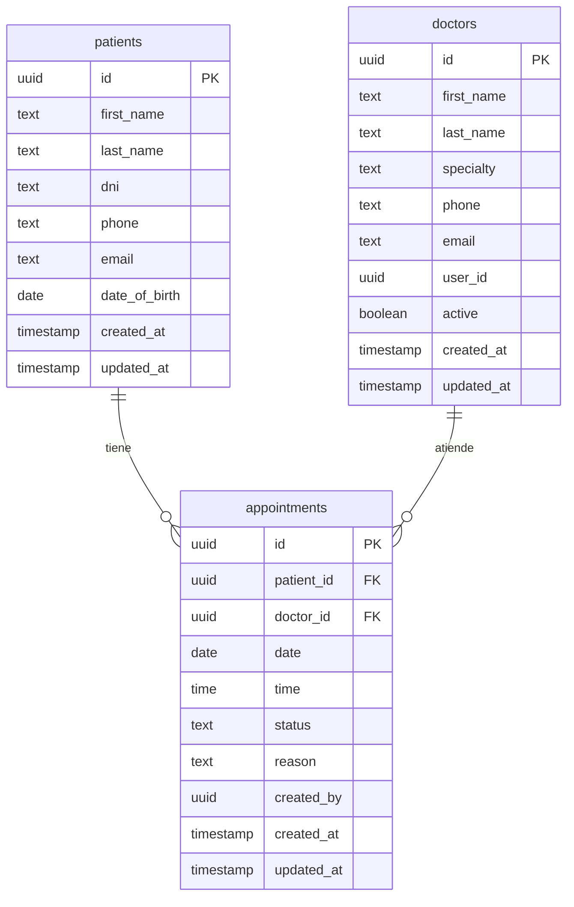

# 🏥 TurnosClinic

Sistema integral de gestión de turnos médicos diseñado para clínicas y consultorios pequeños.


## 📋 Descripción

TurnosClinic es una aplicación web moderna para la gestión eficiente de citas médicas. Permite a recepcionistas y personal administrativo organizar turnos, gestionar pacientes y mantener un seguimiento en tiempo real del estado de las consultas.

## ✨ Características Principales

- **📅 Vista de Calendario Semanal**: Visualización intuitiva de turnos por día y hora con código de colores por estado
- **📊 Vista de Tabla**: Listado detallado de todos los turnos con filtros avanzados
- **🔍 Búsqueda Inteligente**: Autocompletado de pacientes con creación rápida inline
- **👥 Gestión de Pacientes**: Base de datos completa con información demográfica y de contacto
- **⚡ Actualizaciones en Tiempo Real**: Sincronización automática de cambios entre usuarios
- **🎨 Interfaz Profesional**: Diseño médico con tema adaptable (claro/oscuro)
- **📱 Responsive**: Funciona perfectamente en dispositivos móviles y tablets
- **🔐 Autenticación Segura**: Sistema de login y registro de usuarios
- **🏷️ Estados de Turnos**: Seguimiento de pendiente, confirmado, atendido, cancelado y ausente

## 🛠️ Stack Tecnológico

### Frontend
- **React 18** - Biblioteca de UI
- **TypeScript** - Tipado estático
- **Vite** - Build tool y dev server
- **Tailwind CSS** - Estilos utility-first
- **shadcn/ui** - Componentes UI reutilizables
- **Radix UI** - Primitivos UI accesibles

### Backend
- **Lovable Cloud** (Supabase) - Base de datos PostgreSQL
- **Row Level Security** - Políticas de seguridad a nivel de fila

### Librerías Adicionales
- **TanStack Query** - Gestión de estado del servidor
- **React Router DOM** - Enrutamiento
- **React Hook Form** - Manejo de formularios
- **Zod** - Validación de esquemas
- **date-fns** - Manipulación de fechas
- **Lucide React** - Iconos

## 🗄️ Esquema de Base de Datos



### Estados de Turnos

| Estado | Descripción |
|--------|-------------|
| `pending` | Turno pendiente de confirmación |
| `confirmed` | Turno confirmado por el paciente |
| `attended` | Paciente atendido |
| `cancelled` | Turno cancelado |
| `no_show` | Paciente no se presentó |

## 🚀 Instalación y Configuración

### Requisitos Previos
- Node.js 18+ y npm

### Pasos de Instalación

```bash
# 1. Clonar el repositorio
git clone https://github.com/tu-usuario/turnosclinic.git
cd turnosclinic

# 2. Instalar dependencias
npm install

# 3. Configurar variables de entorno
# Las variables de Supabase se configuran automáticamente con Lovable Cloud

# 4. Iniciar servidor de desarrollo
npm run dev
```

La aplicación estará disponible en `http://localhost:5173`

### Scripts Disponibles

```bash
npm run dev          # Iniciar servidor de desarrollo
npm run build        # Compilar para producción
npm run preview      # Vista previa de la build de producción
npm run lint         # Ejecutar linter
```

## 📁 Estructura del Proyecto

```
src/
├── components/
│   ├── appointments/       # Componentes relacionados con turnos
│   │   ├── AppointmentDialog.tsx
│   │   ├── AppointmentFilters.tsx
│   │   ├── AppointmentPopover.tsx
│   │   ├── AppointmentsTable.tsx
│   │   ├── NewPatientMiniDialog.tsx
│   │   ├── PatientAutocomplete.tsx
│   │   ├── PatientSearchDialog.tsx
│   │   └── WeeklyCalendar.tsx
│   ├── patients/          # Componentes de gestión de pacientes
│   │   └── PatientDialog.tsx
│   └── ui/                # Componentes shadcn/ui
├── pages/                 # Páginas de la aplicación
│   ├── Auth.tsx          # Login/Registro
│   ├── Dashboard.tsx     # Panel principal de turnos
│   ├── Index.tsx         # Landing page
│   ├── Patients.tsx      # Gestión de pacientes
│   └── NotFound.tsx      # Página 404
├── integrations/
│   └── supabase/         # Cliente y tipos de Supabase
├── hooks/                # Custom hooks
├── lib/                  # Utilidades y helpers
└── main.tsx              # Punto de entrada
```

## 🗺️ Rutas de la Aplicación

| Ruta | Descripción | Acceso |
|------|-------------|--------|
| `/` | Página de inicio con información del sistema | Público |
| `/auth` | Login y registro de usuarios | Público |
| `/dashboard` | Panel principal de gestión de turnos | Autenticado |
| `/patients` | Gestión completa de pacientes | Autenticado |

## 👥 Funcionalidades por Usuario

### Recepcionista / Administrador
- ✅ Ver todos los turnos en calendario y tabla
- ✅ Crear, editar y eliminar turnos
- ✅ Gestionar base de datos de pacientes
- ✅ Filtrar turnos por fecha y médico
- ✅ Actualizar estados de turnos
- ✅ Búsqueda rápida de pacientes
- ✅ Crear pacientes desde el diálogo de turnos

### Médico
- ✅ Ver sus propios turnos asignados
- ✅ Actualizar estados de consultas
- ✅ Acceder a información de pacientes

## 🎨 Características de UI/UX

- **Sistema de Diseño Consistente**: Tokens semánticos CSS para colores, espaciado y tipografía
- **Tema Adaptable**: Soporte completo para modo claro y oscuro
- **Animaciones Suaves**: Transiciones y efectos visuales usando Tailwind
- **Componentes Accesibles**: Cumplimiento de estándares WCAG usando Radix UI
- **Feedback Visual**: Toasts y notificaciones para acciones del usuario
- **Estados de Carga**: Skeletons y spinners durante operaciones asíncronas

## 🔐 Seguridad

- **Row Level Security (RLS)**: Políticas de acceso a nivel de base de datos
- **Autenticación JWT**: Tokens seguros con Supabase Auth
- **Validación de Formularios**: Zod para validación de datos
- **Protección de Rutas**: Middleware de autenticación en rutas privadas

## 🚀 Despliegue

### Lovable (Recomendado)
1. Hacer push de cambios al repositorio
2. Despliegue automático en Lovable Cloud
3. URL personalizada disponible

### Otros Servicios
El proyecto puede desplegarse en:
- Vercel
- Netlify
- Cloudflare Pages

```bash
npm run build
# Subir la carpeta dist/ al servicio de hosting
```

## 🤝 Contribución

Las contribuciones son bienvenidas. Para contribuir:

1. Fork el repositorio
2. Crea una rama para tu feature (`git checkout -b feature/AmazingFeature`)
3. Commit tus cambios (`git commit -m 'Add some AmazingFeature'`)
4. Push a la rama (`git push origin feature/AmazingFeature`)
5. Abre un Pull Request

## 📝 Próximas Características

- [ ] Recordatorios automáticos por email/SMS
- [ ] Integración con calendario Google/Outlook
- [ ] Reportes y estadísticas
- [ ] Sistema de roles y permisos avanzado
- [ ] Historias clínicas básicas
- [ ] Pagos y facturación

## 📄 Licencia

Este proyecto está bajo la Licencia MIT. Ver el archivo `LICENSE` para más detalles.

## 📧 Contacto

Para preguntas o sugerencias, por favor abre un issue en GitHub.

---

Desarrollado con ❤️ usando [Lovable](https://lovable.dev)
